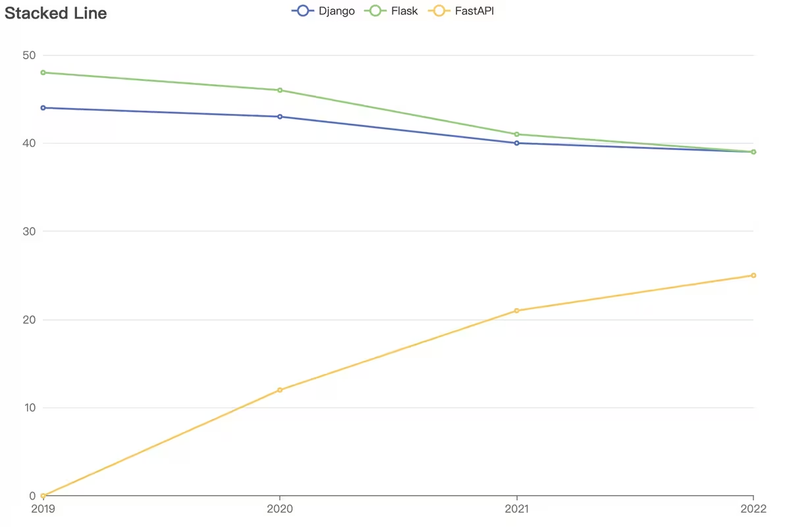

# FastAPI框架

FastAPI 是一个用于构建 API 的现代、快速（高性能）的 web 框架，使用 Python 并基于标准的 Python 类型提示。

FastAPI诞生于2018年底，在2019年年底左右开始崭露头角，在短短的5年里让关注度就超过了在2010年底诞生的Flask。



FastAPI的关键特性：

* 快速：可与 NodeJS 和 Go 并肩的极高性能（归功于 Starlette 和 Pydantic）。最快的 Python web 框架之一。

* 高效编码：提高功能开发速度约 200％ 至 300％。

* 更少 bug：减少约 40％ 的人为（开发者）导致错误。

* 智能：极佳的编辑器支持。处处皆可自动补全，减少调试时间。

* 简单：设计的易于使用和学习，阅读文档的时间更短。

* 简短：使代码重复最小化。通过不同的参数声明实现丰富功能。bug 更少。

* 健壮：生产可用级别的代码。还有自动生成的交互式文档。

* 标准化：基于（并完全兼容）API 的相关开放标准：OpenAPI (以前被称为 Swagger) 和 JSON Schema。


FastAPI的中文文档：[https://fastapi.tiangolo.com/zh/](https://fastapi.tiangolo.com/zh/)

官方文档写得既详细又容易理解，不管是学习还是项目开发时查阅都非常好用。所以我们的教学也基本按照阅读文档的形式来展开。

------

## 1 安装FastAPI并熟悉开发环境

FastAPI 实质上是Python 的一个包，所以我们首先需要一个Python 环境。这里的话强烈建议在工程目录下创建一个虚拟环境，然后将FastAPI及其依赖安装到虚拟环境中。FastAPI 目前是支持Python 3.8到3.12版本。如果不是这五个版本的话，有很大概率会出现问题，所以请先更换Python 版本。

进入虚拟环境中，首先安装FastAPI。它会帮我们同时安装好相关的依赖。然后我们还需要一个ASGI 服务器。

ASGI 全称 Asynchronous Server Gateway Interface，翻译过来叫做异步服务器网关接口。它定义了一套标准接口规范，用于连接 Web 服务器和应用程序框架，实现异步处理请求和响应。ASGI 的目标是提供高性能、可伸缩和灵活的 Web 应用程序开发体验。

简而言之它就是一个把你的电脑变成服务器的工具。有了它我们就可以在我们的电脑上接收网络请求并做出响应。我们这里用的这个服务器叫uvicorn。它是一个轻量级、高性能的ASGI服务器。

现在我们就可以创建一个示例来看一下FastAPI后端开发的基本形式。在工作目录下新建一个main.py文件，把文档里的这个代码复制进来。这个代码中只定义了一个对象和两个函数，并没有进行调用，所以将其当成Python 脚本来运行并不会有任何反应。我们需要使用uvicorn服务器来运行它。

方式1是在终端中运行命令：

```
uvicorn main:app --reload
```

方式2是在main.py文件中添加以下代码：

```
if __name__ == '__main__':
    uvicorn.run('main:app', reload=True)
```
然后就可以将main.py 作为Python 脚本运行。

现在我们的电脑已经变成了一个Web服务器了。我们在示例里面实现了2个API。现在我们可以来试一下他们的效果。有3种方法来测试这个API。

1. *直接在浏览器地址栏输入API的URL，并在后面带上相应的参数* 。比如说 `@app.get("/items/{item_id}")`，这是一个GET请求，它的路径是/items，然后后面跟上一个路径参数item_id，它还有一个可选的查询参数q。那么我们可以直接访问 `http://127.0.0.1:8000/items/5?q=somequery`来测试这个API。然后你会发现浏览器会显示一个JSON格式的响应。

2. *访问由Swagger UI给我们自动生成的API文档* 。只要在我们的服务器运行地址后面加上/docs。如果加载不出来的话可以挂个梯子。它上面会把我们写的所有API都给你列出来，包括请求方法、路径以及API的描述，这个描述实际上就是我们代码里面定义的函数的函数名。它会把小写字母加下划线格式的函数名给你转换成首字母大写空格分词的形式。所以我们给API函数起名字的时候要起成小写字母下划线的形式。点击某个API的名字可以看到它的详细信息。首先是参数，包括路径参数、查询参数。然后是响应，包括响应状态码、响应格式、响应头、响应体。我们点参数这一栏右边的这个try it out按钮，可以对API进行测试。然后我们可以输入参数，点击execute按钮，就能调用这个API，然后看到它给我们返回的响应。这个是Swagger UI提供的API文档。

3. *访问由ReDoc给我们自动生成的API文档* 。它和Swagger UI类似，更加地简洁和美观。但是它只能看，不能进行交互式测试，所以并不如Swagger UI那么方便。

我们在开发过程中基本上都是用第2种也就是Swagger UI生成的文档来进行测试。

## 2 概念解析

刚刚一股脑给大家说了一大堆专业术语，现在我们回过头来详细介绍一下嗷。

### URL

（Uniform Resource Locator）统一资源定位器，用于定位互联网上资源的地址。通常由以下几个部分组成：

1. 协议：指定了访问资源时使用的协议，一般都是HTTP、HTTPS（在HTTP基础上加入SSL加密）等。后面用://隔开。
2. ‌主机(host)：通常指服务器的地址，可以是域名或IP地址。域名就是一段用.分隔的字符串，如www.baidu.com。IP地址就是用.分隔的四个数字，如192.168.0.1。后面用:隔开。
3. 端口(port)：可选部分，用于指定服务器监听的端口号，默认值为80（HTTP）或443（HTTPS）。
4. 路径(path)：指定资源在服务器上的位置，通常由一系列由斜杠（/）分隔的字符串组成。比如"/items/666"。
5. 查询字符串(query string)：跟在路径后面，由问号(?)引导，用于传递参数给服务器。如"?q=somequery"。
6. 锚点(anchor)：跟在查询字符串后面，由井号（#）引导，用于指定页面内的特定位置。

示例：http://127.0.0.1:8000/items/5?q=somequery

### 请求方法

HTTP协议定义了7种请求方法，分别为：


#### **GET**
从服务器获取资源，例如网页、图片、视频等。当用户在浏览器中输入一个 URL 并按下回车键时，浏览器便会向服务器发送一个 GET 请求，要求获取该 URL 对应的资源。服务器处理请求后，会将资源发送回客户端。主要作用是从服务器请求数据，而**不会对服务器上的资源进行任何修改**。往往搭配路径参数和查询字符串一起使用，即将请求的内容附加到URL里面。

通常用于以下场景：

* 获取网页内容：浏览器向服务器请求 HTML 文件以显示网页内容。
* 获取 API 数据：客户端向 API 发送 GET 请求以获取数据，例如获取用户信息、商品列表等。
* 加载资源文件：获取静态资源，如图片、CSS、JavaScript 文件等。


#### **POST**
用于向服务器发送数据，通常是为了提交表单、上传文件、或调用 API 接口以进行数据处理。与 GET 方法不同，POST 请求的数据一般不会附加在 URL 中，而是包含在请求体中。因此，POST 方法适合传输较大或敏感的数据。

典型使用场景包括：

* 提交表单数据：用户在网页上填写表单后，点击提交按钮，浏览器会使用 POST 方法将表单数据发送到服务器。例如，用户注册、登录、提交评论等操作都通常使用 POST 方法。


#### *PUT*
用于更新服务器上的资源，数据一般包含在请求体中。相同的 PUT 请求无论执行多少次，服务器上的资源状态应不会改变。

典型使用场景包括：

* 更新用户信息：用户修改个人资料时，客户端通过 PUT 请求将更新后的信息发送到服务器，服务器接收后更新数据库中的用户信息。

#### *PATCH*
用于对服务器上的资源进行部分更新。与 PUT 方法不同，PATCH 请求不需要包含完整的资源数据，而只需要传输需要更新的部分字段。因此，PATCH 方法非常适合用于需要频繁更新部分数据的场景。

PATCH 方法的典型使用场景包括：

* 更新用户部分信息：例如，用户想要修改个人资料中的某一项字段，如邮箱地址或电话号码，客户端可以通过 PATCH 请求仅传输需要更新的字段，服务器接收后更新相关字段的数据。

* 更新文档部分内容：在文档管理系统中，如果需要对某篇文档的部分内容进行更新，而不修改其他部分，可以使用 PATCH 方法传输更新的部分。


#### *DELETE*
用于删除服务器上的指定资源。在 RESTful API 设计中，DELETE 方法通常用于移除指定的资源对象或数据。例如，删除一篇文章、一条评论、或一个用户账户等。DELETE 方法的幂等性特性决定了无论同一个 DELETE 请求被执行多少次，服务器上的资源状态应保持一致，即资源被删除后，再次删除操作不会产生任何新的效果。

典型使用场景包括：

* 删除用户账户：当用户决定注销自己的账户时，客户端可以发送一个 DELETE 请求到服务器，要求删除该用户的账户信息。
示例：
* 删除文件或记录：在文件管理系统或数据库管理系统中，DELETE 方法常用于删除指定的文件或数据库记录。


### JSON数据格式
JSON（JavaScript Object Notation）是一种轻量级的数据交换格式，它基于ECMAScript的一个子集。它采用了类似于JavaScript的语法，但是比起XML更加紧凑和易读。JSON格式的目的是用来传输数据，易于人阅读和编写，同时也易于机器解析和生成。

JSON实质上是一个无序的键值对集合，很像Python中的字典。它的键必须是字符串，值可以是字符串、数字、布尔值、数组、对象或null。用冒号(:)分隔键和值，用逗号(,)分隔不同的键值对。

例如：
```
{
  "name": "John",
  "age": 30,
  "isStudent": false,
  "hobbies": ["reading", "coding"],
  "address": {
    "street": "123 Main St",
    "city": "New York"
  },
  "isMarried": null
}
```

JSON可以进行任意深度的嵌套，因此可以表示复杂的数据结构。比如我们用Swagger UI生成的API文档，其实就是一个JSON格式的文档，我们只是把它转换成HTML文件渲染出来。


### IP地址
IP地址（Internet Protocol Address）是指互联网协议地址，它唯一标识网络中的计算机。由用.分隔的四个数字组成。
例如：192.168.0.1。

我们刚刚启动uvicorn服务器时，它的IP地址是127.0.0.1，这是一个特殊的IP地址，表示本机（我们的电脑），只能在我们电脑上访问，一般在开发环境中使用。

除此以外IP地址分为私网IP和公网IP。私网IP是指在局域网中分配的IP地址；公网IP是指在互联网上分配的IP地址。具有公网IP的设备可以被互联网上的其他设备访问。

### 域名
域名（Domain Name）是指通过域名系统（DNS）来解析IP地址的主机名，用.分隔的字符串来表示。例如www.baidu.com就是一个域名。它是对IP地址的一种友好表示，便于记忆和使用。像我们的本机IP地址127.0.0.1，也可以通过域名localhost来访问。

### 端口
端口（Port）是指网络通信中使用的一个虚拟通道，用于不同应用程序之间的通信。端口号是一个16位的整数，范围从0到65535。我们会把不同的应用程序绑定到不同的端口上。比如你有两个FastAPI应用，分别绑定到端口8000和8001，那么它们就可以同时运行在你的电脑上，然后你通过在URL后面加上端口号来指定访问哪个应用。

## 3 FastAPI应用的基本结构
首先我们从fastapi模块中导入FastAPI类，创建一个实例对象app。然后我们可以用这个对象来写API。

第一步是用FastAPI类的内置装饰器来定义API的请求方法和道德4路径。方法是@你这个FastAPI对象点上请求方法，然后参数是你这个API的路径，用字符串来表示。这个装饰器的实现我们不需要去了解，只需要知道它是告诉Python 接下来这个函数会是一个API。然后接下来我们就可以在这个函数里面实现我们的API逻辑。这个函数我们叫它**路径操作函数**。每当 FastAPI 接收一个使用 GET 方法访问 URL「/」的请求时这个函数会被调用。

这个函数在定义的时候除了用`def`外，还可以用`async def`来定义一个异步函数。

对于异步这个概念，FastAPI文档里给我们做了很生动的解释。

这里我给大家概括一下。如果采用异步编程的话，比如前端给我们发送了一个请求要调用一个API，然后这个API的逻辑非常复杂，需要相当一段时间才能处理完，而这时前端那边又发过来一个新的请求，我们可以让前面那个API到一边去慢慢处理，而我们先来响应新的请求，然后这个请求调用了一个新的API，我们也让它到一边去慢慢处理，我们继续等着响应别的请求。这期间我们时不时去询问一下这两个API处理完了没有，没有的话就接着干，处理完了我们就给它把返回的数据发送回前端。这就是用异步的思想通过并发的方式来提高程序的运行效率。

如果不用异步的话，那么一旦我们接到了一个请求，在这个请求处理完之前，其他的请求都只能排队干等着，不能响应，白白地浪费时间。

文档里面给我们举了一个排队买汉堡的例子，大家有兴趣可以看看，它表达的核心思想和我刚才讲的是一样的。

总而言之就是，在恰当的地方采用异步编程，可以提高系统的性能。

而在FastAPI中实现异步的方式叫“协程”。所谓“协程”就是用看起来很像顺序执行的代码的形式来实现异步，所以会非常直观易于理解。具体做法是用`async def`关键字来定义函数，然后在调用需要等待才能有结果的函数时加上`await`关键字。

当然现在大家可能不知道有什么需要等待才能有结果的函数，那在你不清楚具体情况的时候，直接用`def`来定义普通函数也够了，对我们写的项目来说数据量都不会太大，所以同步异步的差异一般也不明显。


现在我们就可以用uvicorn服务器来运行这个FastAPI应用了。启动uvicorn的时候一般要指定四个参数：

1. 应用的名称，格式为文件名:应用实例名。比如main:app。
2. 主机地址，一般用127.0.0.1。这个参数默认就是127.0.0.1，所以一般不用给。
3. 端口号，一般用8000，如果8000被占用了，可以用其他的端口号。
4. 重载模式，开启reload模式可以让代码改动后自动重启服务器更新应用。

启动以后在终端会输出服务器运行的日志，像这个样子，告诉你服务器运行的URL。我们按住Ctrl键点击这个URL，就可以直接访问。后面还说了Ctrl+C可以停止服务器。我们后面每次发送网络请求的时候，这里都会输出相应的日志。包括请求的端口号，请求方法，请求路径，请求参数，响应状态码。

这个响应状态码，具体来说就是HTTP状态码（HTTP Status Code）是用以表示网页服务器超文本传输协议响应状态的3位数字代码，第一位数字表示响应类别。

|响应码  |类别   | 解释|
|:--------: | :-----: | :-----: |
|1xx | 信息性响应（Informational）| 表示请求已经接受，正在继续处理|
|**2xx** | **成功响应（Successful**）| 表示请求已经被成功接收、理解并接受|
|3xx | 重定向信息（Redirection）| 表示要完成请求必须进行更进一步的操作|
|**4xx** | **客户端错误响应（Client Error**）| 表示请求有语法错误，或者请求无法实现|
|**5xx** | **服务器错误响应（Server Error）**| 表示服务器未能实现合法的请求|


具体的常见的状态码有：

- 200 OK‌：请求已成功，服务器返回所请求的资源。
* ‌201 Created‌：请求已成功，服务器创建了新的资源。
* ‌400 Bad Request‌：请求无效。
* ‌401 Unauthorized‌：需要身份验证。
* 403 Forbidden‌：服务器拒绝请求。
* ‌404 Not Found‌：资源未找到。
* 500 Internal Server Error‌：服务器内部错误。
* 502 Bad Gateway‌：网关错误。
* 503 Service Unavailable‌：服务器暂时不可用。


## 4 路径参数
路径参数就是把参数塞进URL路径里面进行传递。像f-string一样的占位符来表示参数的值，实际的参数值将替换占位符部分。首先在装饰器参数中添加路径参数，再把路径参数作为函数的输入参数，然后就可以在函数里面进行使用。一个请求里面也可以有很多个路径参数。这里我们把输入进来的路径参数以字典的形式返回回去。对于这样一个API，我们可以在浏览器地址栏输入url来测试。然后会它给我们返回了一个JSON数据。这里FastAPI是自动帮我们把字典转换成了JSON数据。或者呢，我们也可以进入到Swagger UI里面找到这个API点击Try it out按钮，然后以表单的形式输入路径参数，点击执行按钮，会发现它自动把我们输入的参数塞到URL里面发送请求，然后响应体的格式和刚才看到的是一样的。

我们在定义路径操作函数的时候，通过Python 类型注解的方式来说明了路径参数的数据类型，然后FastAPI 会借助Pydantic的力量 在请求的时候自动帮我们进行类型校验。你看文档这边明确标识了这两个参数一个是字符串，一个是整数，如果你不输入对应类型的值的话，它会直接给你报错，不让你发送请求。

路径参数在使用的时候需要注意顺序。比如说这边这个例子。

然后对于路径参数的值，有一个预设值的概念。它是通过Python 内置的Enum类来把路径参数限定为有限个设定好的值。比如说我们有个路径参数叫食堂，那在兴隆山它就只能取“欣园”和“悦园”这两个值，那我们就可以把它作为预设值。

如果要在路径参数中输入路径，你直接输的话，FastAPI没有办法分辨哪里是请求的路径，哪里是参数的路径，所以要在占位符的地方参数名后面加上:path。

## 5 查询参数