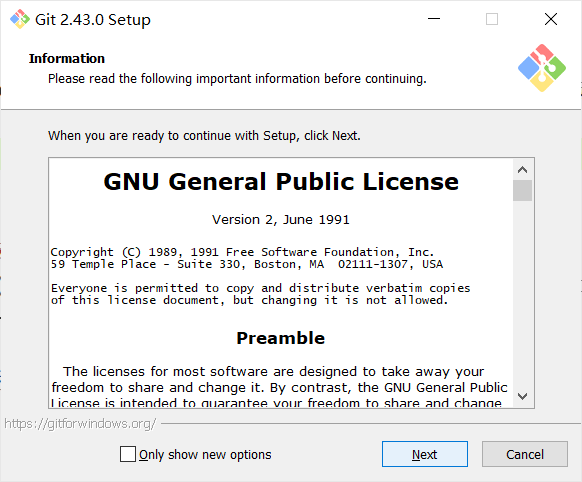
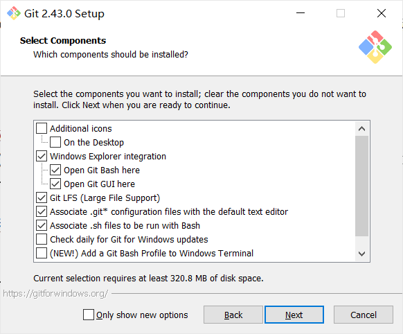
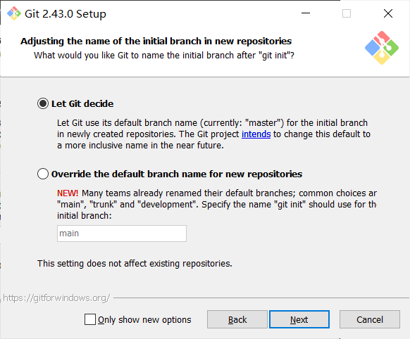

# 1 Git的安装

## 如何安装 Git

### Windows系统
#### 通过安装包安装
安装包可以在[官网](https://git-scm.com/)下载，但是大概率需要科学上网。如果无法访问网站，可以直接去群里下载安装包（文件名：Git-2.43.0-64-bit.exe）。

下载好以后打开安装程序。

点Next。

然后选择安装路径，可以自定义一个路径，也可以默认安装到C盘。

看不懂，那就保持默认选项，继续点Next。

选择默认编辑器，这里如果大家不知道这些个编辑器是什么的话，就选图上的选项（Visual Studio Code），然后点Next。

看不懂，还是保持默认，继续点Next。

后面还有很多选项，看不懂的话直接全保持默认一路Next就行。

### 其他系统
😰我也不会，可以去群里问别的大佬或者自行解决。

## 如何检验安装成功
快捷键Windows（一个窗户图标的键）+ R 输入 cmd 或者 PowerShell 后回车打开命令行窗口，输入以下命令后回车：

    git --version

如果出现类似 git version 2.43.0.windows.1 的输出就（大概）算安装成功。

# 2 注册一个GitHub 或者Gitee 账号

‌GitHub和‌Gitee都是基于Git的代码托管平台。Gitee实际上可以看成是国产GitHub。二者功能类似，但是有条件的话建议还是选择GitHub。

## Gitee注册
没什么特别的，打开[Gitee官网](https://gitee.com/)点击右上角**注册**即可。

## GitHub注册
尝试访问[GitHub官网](https://github.com/)。如果你能成功打开的话，那么说明你的运气不错😋。不能打开的话也不要急，因为这是很正常的情况。事实上，即使你现在能打开，也不能保证明天后天大后天都可以。这是因为出于政治、安全和信息控制等方面的考虑GitHub在国内处于被半墙的状态。实际上无法访问GitHub的原因可能比较复杂，底层机制我也说不清楚😵。对于解决这一问题的办法，大家在网上可以搜到很多文章，大致是修改Hosts文件ip地址啊之流的方法，但是这种方法呢一个是很难搞，另一方面是可能不起作用或者不是一劳永逸的。所以我这里比较推荐大家直接选择最简单稳健的方法-科学上网😃。

不会膜法的同学可以去学习一下：[科学上网教程](ladder.md)

打开[GitHub官网](https://github.com/)点击右上角**Sign up**进行账户注册，然后按照提示一步步操作即可。

注册完登录账号后还有一件事情要做，就是启用Two-factor authentication（2FA）双重身份验证。参考下面这篇文章：

[如何启用GitHub双重身份验证](https://blog.csdn.net/KRISNAT/article/details/140762848)

以后登录时再遇到2FA验证，你都需要打开手机上的Authenticator查看动态更新的6位验证码。

# 3 开始学习Git

好了，你已经成功配置好了Git环境，现在可以[开始学Git](git2.md)