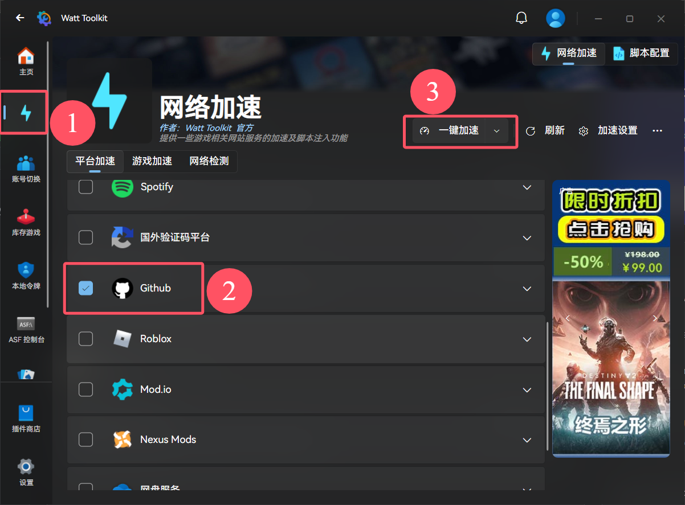
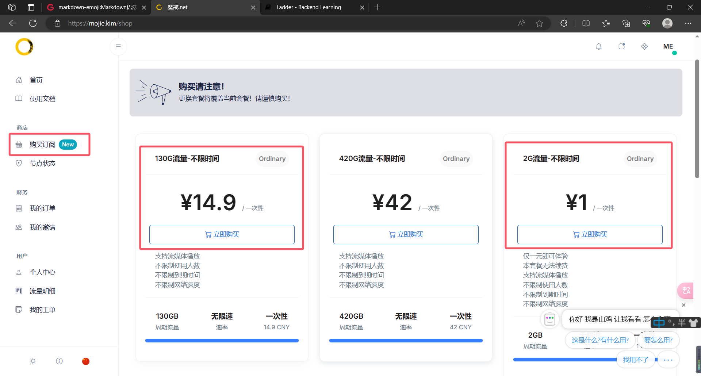
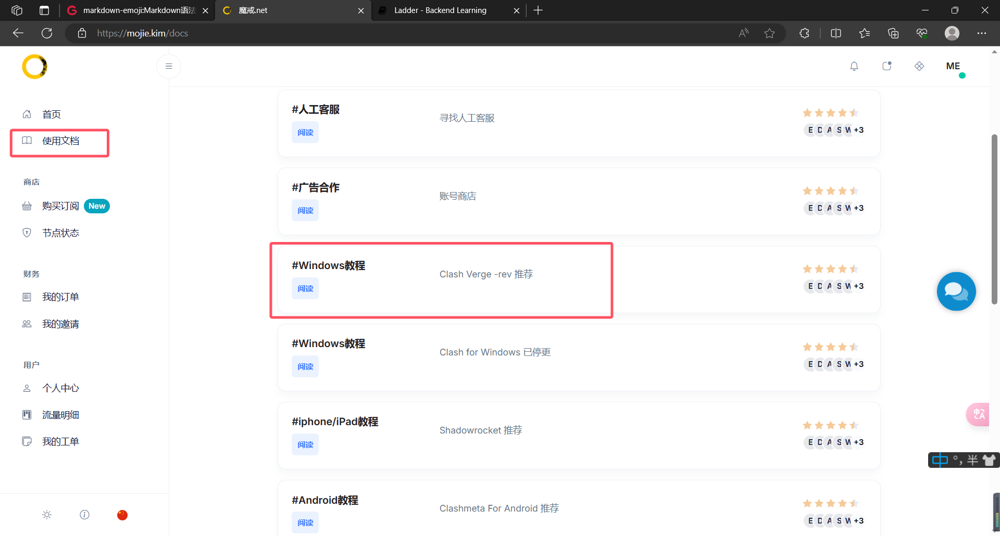

# 关于翻墙

“墙”指的是我国的“国家公共网络监控系统”-GFW，俗称中国国家防火墙。“墙”的存在对于广大网友而言，最直接的感受就是：有一些网站我们“上不去”。而“翻墙”，通常指的是通过各种技术手段绕过国家的互联网审查和封锁，访问被封锁的网站、应用或内容。

*请注意，“翻墙”违法！只要使用了“翻墙”软件，不管目的是什么，学英语也好，查资料也罢，甚至什么都没有浏览，都属于违法行为。*

不过话是这么说，但是只要我们注意分寸，不去墙外搞什么大动作的话，正常来说是不会有人找我们麻烦的。

# 翻墙的方法

## 加速器
网络加速器是一种专门优化网络连接的软件，通过各种技术手段，提高用户的网络传输效率，降低延迟。尤其对于某些对网络质量要求较高的在线游戏来说，网络加速器可以有效减少丢包现象和延迟，从而提升游戏体验。用户在使用网络加速器后，可以享受到更加流畅的游戏过程，特别是在与其他玩家对战时，反应速度至关重要。因此可以看出加速器的特点是针对特定的网络服务提供高质量的网络连接，尤其体现在连接的稳定性上，因此常用在游戏加速场景。其缺点是可供加速的服务范围有限。

这里推荐一款**免费**的加速器——[Steam++](https://steampp.net/)。是的，你没有看错，它确实叫这个名字。

下载安装完成后打开软件，左侧导航栏选择网络加速，勾选GitHub选项，然后点击一键加速即可！

不过这种方法在远程推送时有可能出现一些问题，因此保险起见建议使用下面的方法。当然你可以先试试看，毕竟是免费的😆。

## VPN（俗称梯子）
‌梯子‌，通常指的是‌VPN（虚拟私人网络）服务，其主要目的是绕过地理限制，访问被屏蔽的内容。梯子的优点是允许用户访问全球互联网内容，无论是视频、社交媒体还是其他服务，而不受地理位置的限制。梯子更侧重于提供广泛的网络访问能力，而不是优化特定的网络连接，所以其缺点就是提供的网络连接不像加速器那般稳定，可能会产生卡顿，但是鉴于我们一般使用梯子来浏览网页、视频或其他一些非即时服务，因此偶尔的卡顿并不会产生严重影响。

这里推荐大家在[魔戒](https://mojie.kim)上购买VPN服务。

可以记一下这个网址：[https://mojie.kim](https://mojie.kim) 或者是 [魔戒.net](https://魔戒.net)

注册账号登录后，点击左侧的购买订阅购买套餐，可以先花1块钱买个2G流量玩玩，或者手头阔绰的话直接花14.9块钱买个130G流量实现翻墙自由。注意所有套餐的流量都是不限时的，可以用到天荒地老。

买完套餐以后点击左侧的使用文档，找到教程，然后按照教程操作就可以了。有什么问题可以去问网页右下角那个客服。

**注意**：开启软件后，打开系统代理就是挂上梯子，关闭系统代理就是关掉梯子。当然直接退出软件也可以关掉梯子。