# 1 安装Python

打开Python**官方**网站 [www.python.org](https://www.python.org)

*国内访问可能有点卡，如果实在进不去可以挂梯子*

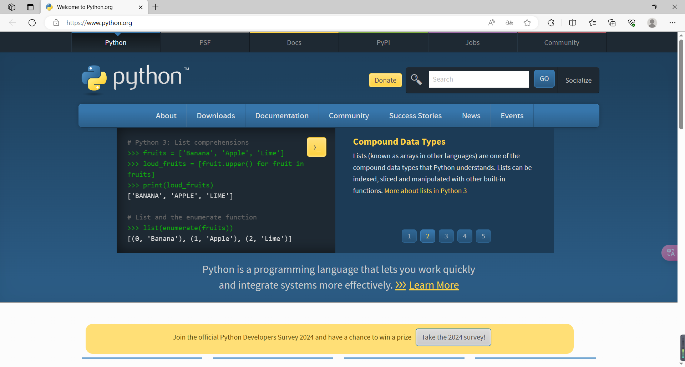

点击 `Downloads`

可以看到Python 在前不久刚刚推出了3.13版本。一般来说，比较新的版本在初期都会有一些bug需要修复，并且对于某些库的支持也可能存在问题（别问我怎么知道的😡）。因此在实际生产时不建议使用最新版本。从下图可以看到目前3.13和3.12版本还处于 `bugfix` 状态。而更早的版本已经 `security` 了。对于未安装Python的同学来说现在推荐安装3.11和3.12版本。如果你已经安装了较早的Python 版本（3.9/3.8或者更早的），那么是时候该更新了！3.10以后的版本中加入了一些利于Web后端开发的内容😍。

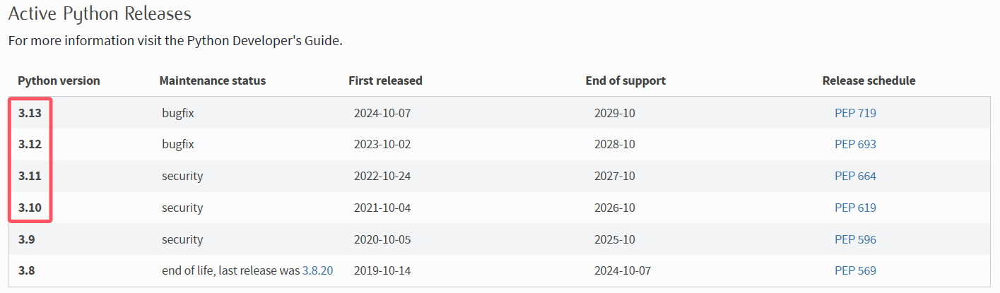

假如我们要安装3.12版本，点击这里的 Python 3.12.7 进入详情页。

然后翻到最底部，选择大家电脑操作系统所对应版本的安装包进行下载。

如果你不知道自己电脑的Windows 系统是64位还是32位的，可以**右键**单击桌面上的**此电脑**然后在菜单中选择**属性**进行查看。（大部分电脑应该都是64位系统）

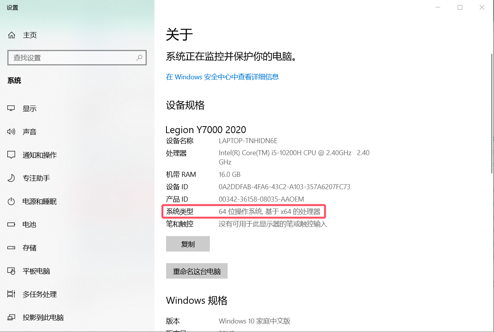

打开下载好的exe文件，把下面的两个复选框都勾上（如果能勾的话就勾上，不能勾说明你已经有相关组件，就不用管了）。在弹出的窗口中点击 `Customize installation`。

Optional Features不用改动（如果py launcher能勾选的也勾上），直接点击 `Next`。

Advanced Options必须勾选下图框出来的四个选项（不能勾的也别管了），其余选项随意，想勾也可以勾。最下方自定义一个安装路径，如果你的电脑进行了磁盘分区的建议不要装在C盘。

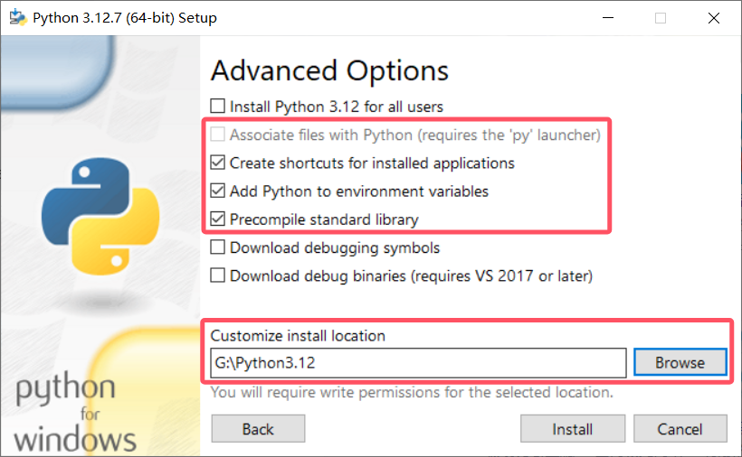

现在点击Install就可以把Python 安装到你的电脑上并自动配置好环境变量了！安装完毕后关闭程序即可。

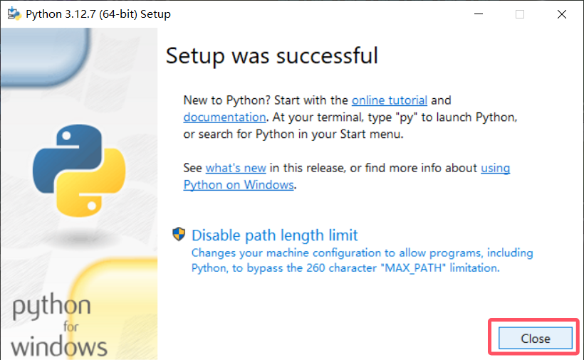

然后你就可以在开始菜单中找到大蟒蛇了！

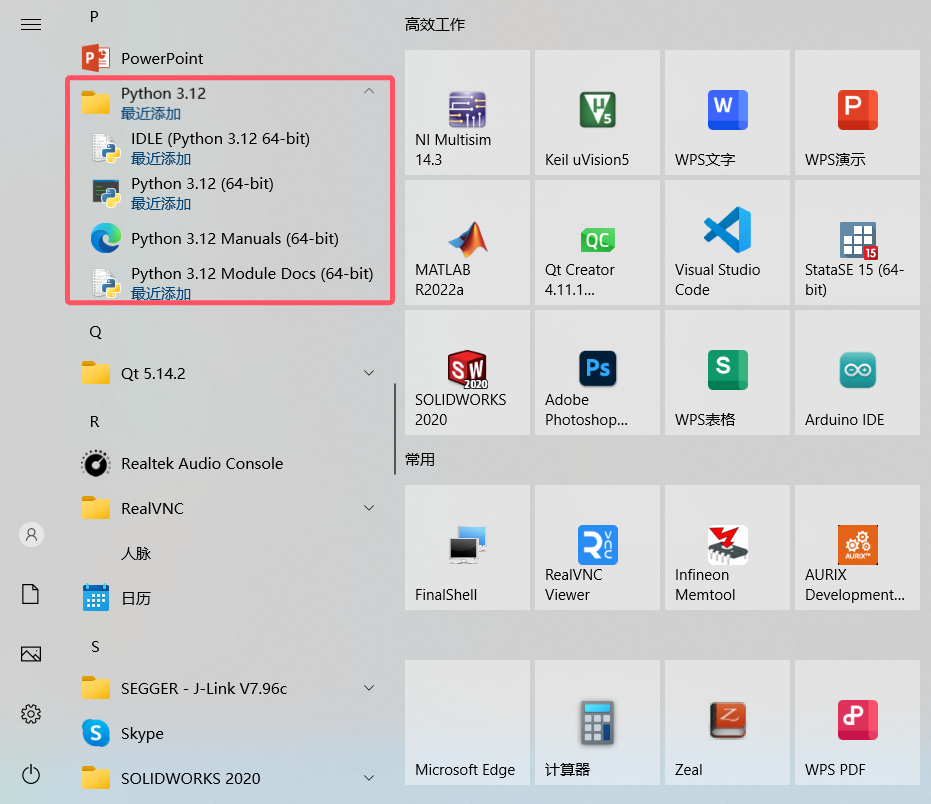

# 2 配置Vscode开发环境

众所周知，要想在VSCode 中进行高效的软件开发，离不开插件的帮助。对于Python 开发而言，我们可以安装以下这些插件：

* Python
* Pylance
* Python Debugger
* Python Extension Pack
* Python Indent
* Jupyter

现在让我们新建一个文件夹Test 然后用VSCode 打开它。在里面新建一个文件，命名为 `demo.py`。当你创建一个后缀名为py的文件时，系统就会知道这是一个Python源文件，我们就可以用解释器来执行它。

在文件中输入

    print(666)

接着点击界面右下角的**选择解释器**（如果你已经选择过的话，这个位置就会显示Python解释器的版本）。此时正上方会弹出一个小窗口，一般来说会自动识别到你Python 安装的位置（如下图所示），直接点击路径即可。如果没有识别到的话，也可以点击输入解释器路径手动输入，路径为你安装Python所在的文件夹中的 `python.exe` 文件。

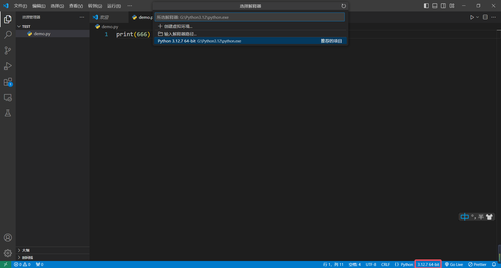

选择完成后就可以点击右上角的三角形按钮运行程序了。在下方的终端中可以看到程序打印出来的内容。

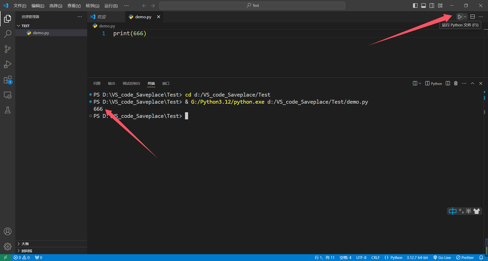

在顶部导航栏选择**文件-首选项-键盘快捷方式**，在搜索框搜索运行Python。然后双击下图中红框区域进行快捷键的绑定。（我绑定的为 `F5`）

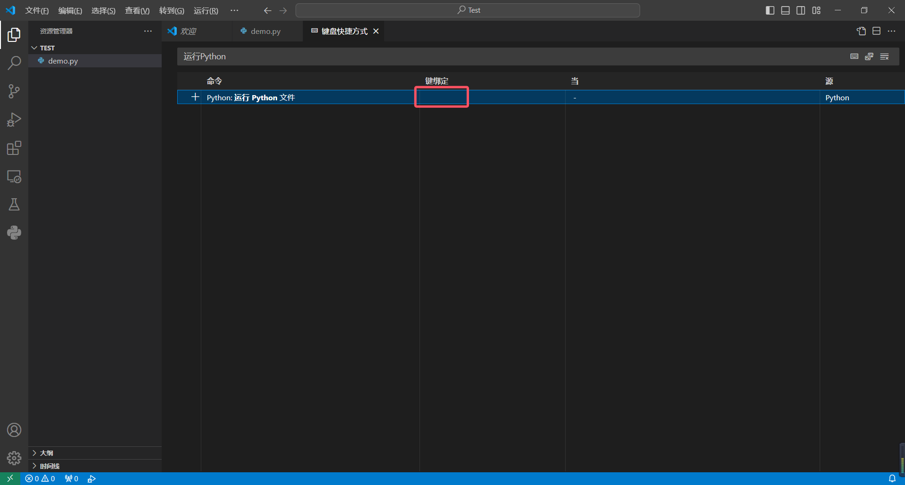

接着我们再新建一个文件命名为 `jupyter.ipynb`，双击打开，我们就可以开始使用Jupyter Notebook 进行交互式编程了。点击右上角的选择内核来选择Python解释器。

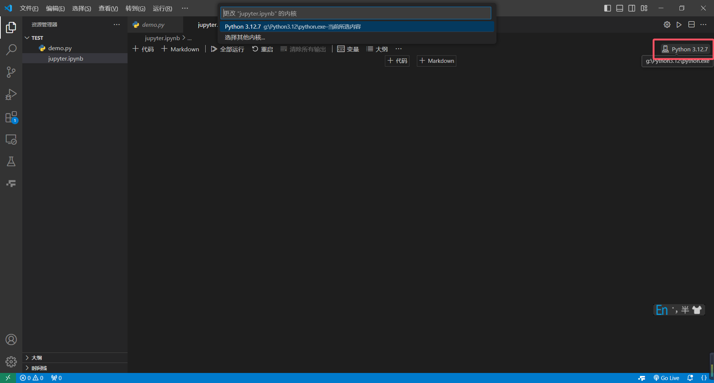

然后添加一个代码单元格，输入一些代码并运行（快捷键貌似是 `Ctrl+Enter`）。

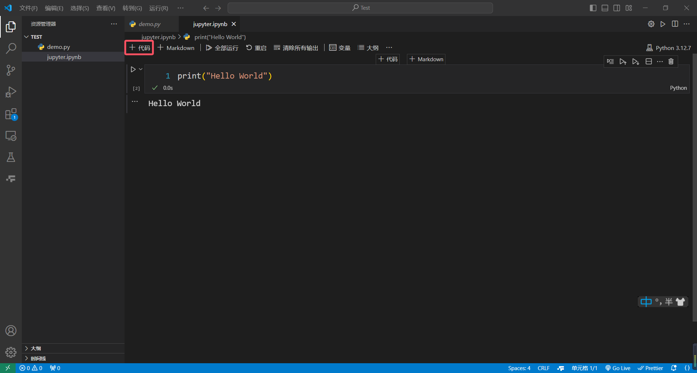

正常来说，如果你是第一次运行jupyter文件的话，大概率会弹出来一个这样的窗口。

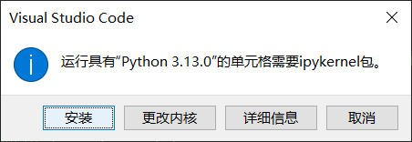

这是因为在jupyter文件中运行Python程序需要ipykernel这个包，点击安装即可，可以说是非常人性化了！